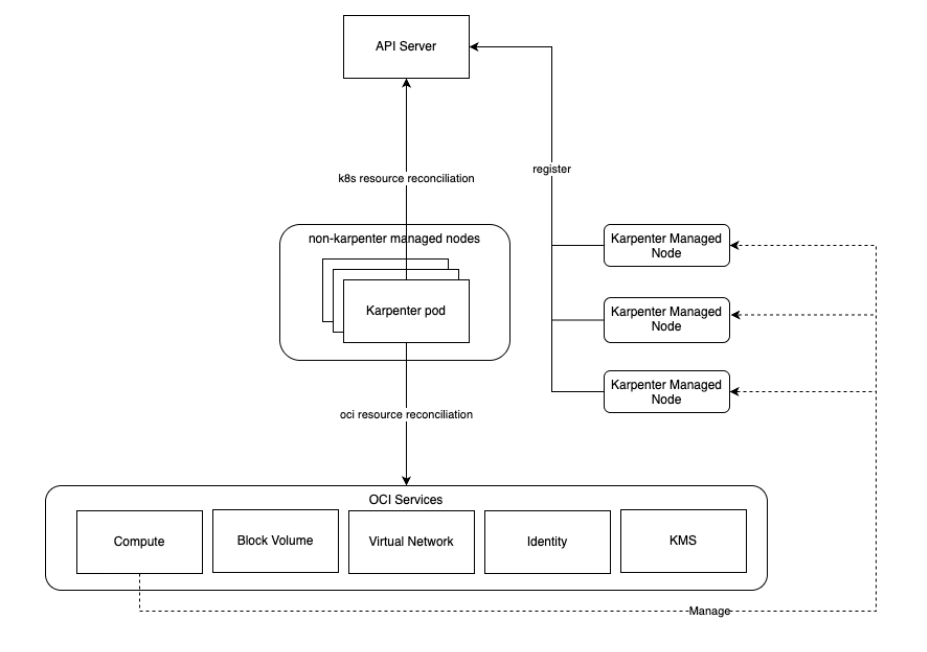

# Architecture View

The KPO controller runs inside the Oracle Kubernetes Engine (OKE) cluster and should be scheduled onto a managed node pool. At least one managed node pool is required to host the KPO controller and other cluster add-ons and to provide baseline capacity.

KPO implements OCI-specific provisioning on behalf of Karpenter. When Karpenter determines that additional capacity is required, KPO translates the desired node requirements into OCI Compute API calls to provision worker instances that then join the OKE cluster.

Karpenter’s desired state is expressed through Kubernetes custom resources:

- **NodePool** defines the scheduling and lifecycle intent for nodes (for example, disruption and consolidation behavior, constraints, and labels).
- **OCINodeClass** provides OCI-specific configuration used to launch nodes (for example, image selection, networking, and shape constraints).

For background on Karpenter concepts and APIs, refer to the upstream [Karpenter documentation](https://karpenter.sh/)

Provisioning overview:

1. The **OKE cluster** runs the KPO controller and Karpenter (core), scheduled onto a **managed node pool**.
2. When a workload cannot be scheduled and remains pending, **Karpenter** derives node requirements (for example, CPU/memory, taints/tolerations, labels, and topology constraints).
3. The **KPO controller** resolves compatible OCI offerings and launches one or more **Compute** instances using the configured image and network settings.
4. The instances bootstrap with the OKE worker configuration and register with the cluster as nodes.
